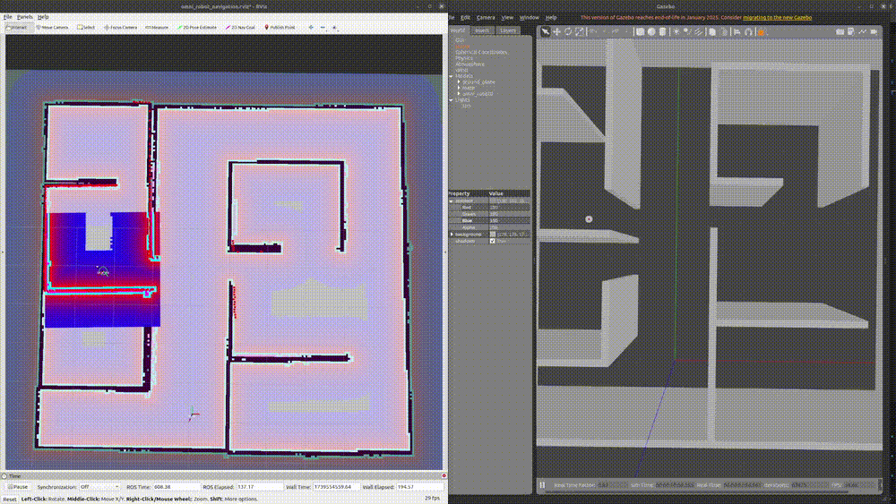

# Three-Wheeled Omnidirectional Gazebo Simulation

## Introduction

This repository contains a Gazebo simulation for a 3-wheeled omnidirectional robot, useful for robotics research and simulation.

### Tested on

- Ubuntu 20.04
- ROS Netic

## How to run

Please clone this repository to your catkin workspace. The following assume your catkin work space placed on your home directory with named **catkin_ws**

```bash
cd ~/catkin_ws/src
git clone https://github.com/YePeOn7/omni_robot_gazebo.git
cd ~/catkin_ws
catkin_make
source devel/setup.bash
```

After that you can run several simulation

### 1. Line following

Provide simulation the robot that following the line track

```bash
roslaunch omni_robot_gazebo omni_world.launch
```

### 2. Manual Teleop on empty world

```bash
roslaunch omni_robot_gazebo omni_empty_world.launch
```

### 3. SLAM Gmapping

Start the SLAM gmapping by using the following command

```bash
# run gazebo maze
roslaunch omni_robot_gazebo omni_maze.launch

# run gmapping 
roslaunch omni_robot_slam omni_robot_gmapping.launch
```

You can use teleop to control the robot movement

```bash
rosrun teleop_twist_keyboard teleop_twist_keyboard.py
```


After the mapping process done you can use the following command to save the map

```bash
rosrun map_server map_saver -f <location>
```

### 4. Navigation (Set Goal Through Rviz)

Open Gazebo and RViz by using the following command

```bash
roslaunch omni_robot_gazebo omni_maze.launch
roslaunch omni_robot_navigation omni_robot_navigation_rviz.launch
```

In the the Rviz, please use the **2D Nav Goal** tool to select the goal in the map and the robot will navigate there



## Special Thanks

- [robot mania](https://www.youtube.com/@robotmania8896)
- [KairongWu](https://github.com/KairongWu)
